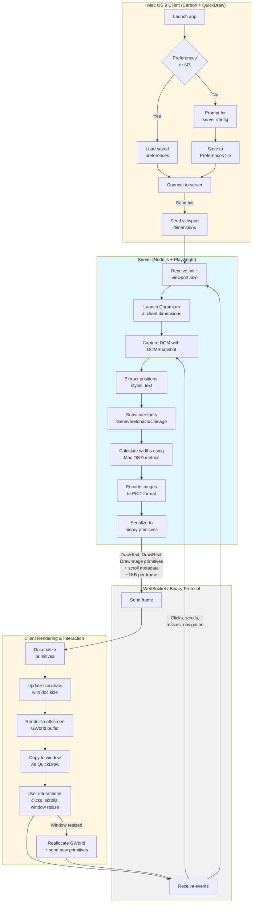

<div align="center">

# Mochila

### Browse today's web on yesterday's Mac


*Browse and interact with modern web sites on your classic Mac at light speed!*

</div>

---
Mochila lets Mac OS 9 machines browse modern websites. Rather than streaming pixels or running a bloated browser on-device, it extracts drawing primitives from Chromium's layout engine and streams those to a native QuickDraw client. Sub-second page loads, and interactivity that is actually snappy!

## How it works




## Getting Started

### Server

```bash
# Install dependencies
npm install

# Run Server
npm start
```

The server will start on `ws://0.0.0.0:8080` and wait for the client to connect.

### Client

1. **Start the server first** (see above)
2. See `client-macos9/README.md` for CodeWarrior 8 build instructions
3. Build and run the app
4. **First Launch:** A console window will appear prompting you to configure the server
   - Enter the IP address of the machine running the server (must be reachable by your Mac)
   - Enter the server port or press Enter to use the default (8080)
   - Settings are saved to `System Folder:Preferences:Mochila Preferences`
   - The main browser window will then open and connect
5. **Subsequent Launches:** Connects automatically using saved preferences

---

## System Requirements

### Server
- Node.js 18+
- Chromium installed (however Playwright should install a compatible version)
- Sufficient CPU/RAM to run Chromium in the background

### Client
- Mac OS 9 with Carbon API (9.2.2 is recommended and tested, however, you might get away with 9.1)
- 16MB-ish of free RAM (This is mostly a guess. In my testing, I couldn't get the client to eat more than 16MB.)
- Tested with a 500MHz iBook G3 with 256MB of RAM installed. YMMV.

---

## Architecture

### Why primitives instead of pixels?

Image-based approaches like [Browservice](https://github.com/ttalvitie/browservice) are great, but they have some drawbacks, namely:
- **Anti-aliased text compresses poorly:** Subpixel rendering creates unique
pixels at every scroll position, limiting the effectiveness of Tight-based diffing encoders like TightVNC.
- **Scrolling** requires sending a new image for every scroll, which is slow and bandwidth intensive on old machines.
- **Little interactivity:** can't click, scroll, or navigate easily.

 

**Mochila's solution:** Treat the page as what it actually is: a collection of text, boxes, shapes, and images at specific coordinates. Simply do all the heavy lifting on the server (using Chromium), and just tell the client what to draw. This approach has several advantages:
- **Scrolling is trivial:** Just move primitives +/-N pixels. No need to recompute layout.
- **Tiny bandwidth:** Usually less than 10KB per frame after initial load vs. 1MB+ for pixel-based diffs.
- **Fast rendering:** QuickDraw is FAST. Even a low-end G3 can render thousands of primitives in a few hundred milliseconds, and usually a full page is only a few hundred.
- **No client-side compute:** The client just draws. Browsers like [MacSurf](https://github.com/mplsllc/macsurf) run all JS, CSS, and layout logic on device. This is too much to ask of these old machines.


## What Works

- **Static content sites**: Documentation sites, wikis, forums, blogs, etc.
- **Navigation**: Clicking links, scrolling, back/forward
- **Text rendering**: Authentic Mac OS 9 bitmap fonts (Geneva, Monaco, Chicago at present)
- **Images**: Photos and icons via PICT encoding
- **Basic forms**: Text input, buttons
- **Layout**: Boxes, positioning, basic CSS
- **Dynamic viewport resizing**: Window can be resized and content re-renders at new dimensions
- **Horizontal & vertical scrolling**: Native Mac OS 9 scrollbars with keyboard support
- **Persistent preferences**: Server configuration saved across launches 

## Limitations

### By Design

- **No client-side JavaScript** - All computation is done on the server to spare the client's CPU and RAM.
- **Image downscaling** - Photos limited to smaller dimensions due to memory and constraints.
- **Single client per server** - Each client needs its own Chromium instance.
- **Server-driven interaction** - Clicks and scrolls round-trip to server. Expect latency. 

### Known Issues

- **Limited CSS support** - Box model only. No flexbox, grid, transforms, animations, etc.
- **React/SPA frameworks mostly broken** - Complex layouts and dynamic content usually fail.
- **No video or audio** - Only static images and text.
- **Scrolling can be janky** - Performance varies by page complexity. I'm still refining the scrolling and primitive tracking logic.
- **Incomplete rendering** - Some CSS properties ignored, so text may overflow on complex layouts.
- **Eats CPU cycles at idle** - Not sure precisely why just yet, but it does. Possibly something to do with the client's event loop. I'll investigate.
- **Font kerning can be weird** - Text gets horizontally compressed beyond readability in some edge cases. In other cases, spacing is too far apart.
- **Link hover behavior missing** - No underline or cursor change on hover.


## Expected Experience

Think early-mid 2000s mobile device browsing (remember Opera Mini?) rather than full-fledged desktop browsing. 

Even pages that don't render perfectly are often still serviceable. Pixel-perfect reproduction is not the goal, nor will it ever be. Where fully on-device browsers fail entirely, Mochila will often provide a useful, if imperfect, rendering. 

**Best for:**
- Reading articles (Wikipedia, news sites, blogs)
- Documentation and reference material
- Forums and discussion boards
- Simple forms and navigation

**Not suitable for:**
- Modern, bloated web apps (e.g. Gmail, Twitter, and the like)
- Video streaming
- Real-time interactions requiring low latency


## Recommended Sites

- Wikipedia
- Hacker News
- old.reddit.com
- 68kMLA
- Macintosh Garden
- weather.gov

## FAQ

<details>
<summary><b>How do I scroll?</b></summary>
Use arrow keys (up/down for vertical, left/right for horizontal). Native scrollbars are also available, just click and drag them.
</details>

<details>
<summary><b>I can't click links.</b></summary>
Single click should work, but sometimes you may need to click a link a few times. Reposition your cursor if you encounter this issue.
</details>

<details>
<summary><b>Where do I specify my server's IP address?</b></summary>
On first launch, Mochila will prompt you to enter your server address and port. Settings are saved to <code>System Folder:Preferences:Mochila Preferences</code>. To change servers later, just delete the preferences file and restart Mochila.
</details>

<details>
<summary><b>Can I resize the window?</b></summary>
Yes! The window is fully resizable. Drag the grow box (bottom-right corner) or click the zoom box (top-right) to maximize. The viewport dynamically updates and the page re-renders at the new size.
</details>


<details>
<summary><b>How do I compile and run the client?</b></summary>
See <code>client-macos9/README.md</code> for instructions.
</details>

<details>
<summary><b>Where is the .sit file? I just wanna try it out!</b></summary>
Check the Releases tab. However, please note that I'm making changes much faster than I can create new pre-built releases. The release may be a bit stale, but you're welcome to try it. If you want the latest version, you'll have to build it yourself, just follow the instructions in <code>client-macos9/README.md</code>. 
</details>

<details>
<summary><b>Why?</b></summary>
For the challenge, and because sometimes less is more. No animations, no autoplay, no algorithmic BS.
</details>


## Current Status

The project is still in development, but it is already capable of browsing the web. Consider it a prototype, but a working one. It's a little janky sometimes, but it's good enough to use, and will only get better.


## Why "Mochila"?

Spanish for "backpack". Carry only what you need.


