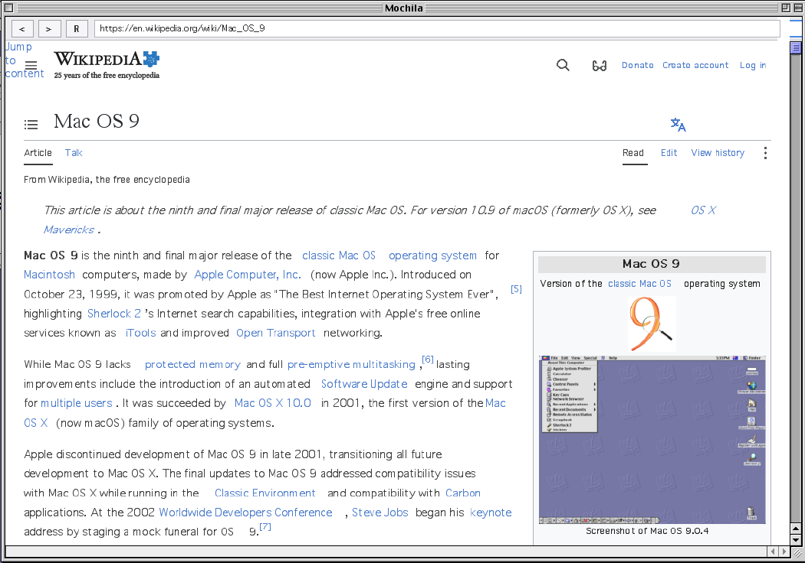

<div align="center">

# Mochila

### Modern-ish and bangin' fast web browsing for classic Mac OS 9



*Browse Wikipedia, Hacker News, and simple modern sites on 25-year-old hardware*

</div>

---

## What is this?

Mochila lets you browse modern websites on Mac OS 9-based machines (e.g. G3/G4-class PowerBooks, iMacs)! Instead of shipping pixels over the network, which would be slow and bandwidth intensive, it streams native drawing primitives extracted from Chromium's layout engine to a native QuickDraw client.

Load Wikipedia, Hacker News, forums, blogs, and tons of other modern sites on actual 25-year-old hardware.

## How it works

**Server** (Node.js & Playwright):
- Opens pages in headless Chromium
- Walks the DOM to extract drawing primitives
- Substitutes fonts using authentic Mac OS 9 bitmap metrics (including Geneva, Monaco, and Chicago)
- Encodes images as native PICT format (with mask compositing for icon fonts)
- Streams primitives over WebSocket using an incredibly lightweight binary wire protocol

**Client** (Mac OS 9.2.2 Carbon):
- Receives primitives via OpenTransport
- Renders natively with QuickDraw
- Double-buffered offscreen GWorld
- Handles clicks, scrolling, navigation

---

## Quick Start

### Server (macOS/Linux)

```bash
# Install dependencies
npm install

# Compile TypeScript
npx tsc

# Run server (default port 8080)
node dist/src/server-live.js
```

The server will start on `ws://0.0.0.0:8080` and load `https://en.wikipedia.org` by default.

### Client (Mac OS 9.2.2)

1. See `client-macos9/README.md` for CodeWarrior 8 build instructions
2. Build and run the Carbon app
3. It will connect to your server's IP address (Specified in `client-macos9/src/main_carbon.cpp` for now)
4. Watch modern web pages render in QuickDraw

---

## Architecture

### Why primitives instead of pixels?

Pixel-based approaches like [Browservice](https://github.com/ttalvitie/browservice) are very useful, but they create some problems:
- **Anti-aliased text** compresses poorly and changes every frame
- **Scrolling** requires sending a new image for every scroll, which is slow, laggy, and bandwidth intensive
- **No interactivity** - can't click, scroll, or navigate easily

Browsers like [MacSurf](https://github.com/mplsllc/macsurf) run all JS, CSS, and layout logic on device. On a 25+ year old machine, it's an uphill battle. The performance requirements are simply too high. Mochila opts instead to do this heavy lifting on a server (using Chromium and Playwright) and stream only the drawing primitives over the network. This keeps the client extremely lightweight and fast.

**Primitive streaming solves this:**
- Text is actually text, not rasterized pixels
- Scrolling merely moves graphical primitives +-N px
- Primitives are tiny and fast to render, even on ancient hardware
- No execution of heavy JS on the client side. Trying to do so on machines from 1998 is a nonstarter. The client just draws.

### Some technical challenges

**Font metrics mismatch** - The hardest problem by far. Chromium computes text layout with modern fonts, but the Mac OS 9 client renders with classic bitmap fonts. Without careful handling, text overflows or overlaps.

**Solution:** Extracted authentic metrics from original Apple bitmap fonts. The server substitutes fonts and computes layout using the exact character widths the Mac OS 9 client will render with!

**Image encoding** - Mac OS 9's QuickDraw library has no built in support for PNG/JPEG/WebP. It uses PICT.

**Solution:** Server converts images to PICT using PackBits compression, handles mask-image CSS via alpha compositing, and downscales photos substantially to fit hardware constraints.

**Change detection** - Only send what changed between frames.

**Solution:** The server tracks primitives across frames and sends only those that changed or scrolled into view.

---

## Technical Details

**Font substitution:**
- Extracted metrics from original Mac OS System 1.0-7.0 bitmap fonts (thx Internet Archive)
- Supports Geneva (9, 10, 12pt), Monaco (9pt), Chicago (12pt) - more to come soon
- CSS weight mapping: 500+ weight activates bold variant

**PICT encoding:**
- PackBits RLE compression for icons and graphics
- JPEG passthrough for photos (QuickDraw native!)
- Downscaling to smaller max dimensions for bandwidth
- Mask compositing via alpha blending for mask-image CSS and SVG

**Wire protocol:**
- Binary format with type-length-value encoding
- Lockstep frame acknowledgment (server waits for client ack)
- Ridiculously lightweight. Usually < 1KB/frame after initial page load.

---

## What Works

- **Static content sites**: Wikipedia, documentation sites, forums, blogs
- **Navigation**: Clicking links, scrolling, back/forward
- **Text rendering**: Authentic Mac OS 9 bitmap fonts (Geneva, Monaco, Chicago)
- **Images**: Photos and icons via PICT encoding (downscaled for bandwidth)
- **Basic forms**: Text input, buttons (no complex form validation)
- **Layout**: Boxes, positioning, basic CSS (margins, padding, borders, colors)

## Limitations

### By Design

- **No client-side JavaScript** - All interaction is server-driven. This matches the security model and capabilities of the era.
- **Image downscaling** - Photos limited to smaller dimensions. Hardware from 2000 can't handle modern high-res images.
- **Single client per server** - Each client needs its own Chromium instance.
- **Server-driven interaction** - Clicks/scrolls round-trip to server. Expect latency.

### Known Issues

- **Limited CSS support** - Box model only. No flexbox, grid, transforms, animations, etc.
- **React/SPA frameworks mostly broken** - Complex layouts, heavy JavaScript frameworks, and dynamic content usually fail.
- **No video or audio** - Only static images and text.
- **Scrolling can be janky** - Performance varies by page complexity. I'm still refining the scrolling and primitive tracking logic.
- **Incomplete rendering** - Some CSS properties ignored, so text may overflow on complex layouts.
- **1024x768 viewport** - Using a fixed viewport size for now. I'll add support for other screen sizes in the future if it doesn't complicate the architecture too much.
- **Eats CPU cycles at idle** - Not sure precisely why just yet, but it does. Possibly something to do with the client's event loop. I'll investigate.
- **Font kerning can be weird** - Text gets horizontally compressed in some edge cases.
- **Link hover behavior missing** - No underline on hover.

---

## Expected Experience

Think early-mid 2000s mobile/constrained-device browsing (remember Opera Mini?) rather than full-fledged desktop browsing.

**Best for:**
- Reading articles (Wikipedia, news sites, blogs)
- Documentation and reference material
- Forums and discussion boards
- Simple forms and navigation

**Not suitable for:**
- Modern, bloated web apps (e.g. Gmail, Twitter, and the like)
- Video streaming
- Real-time interactions requiring low latency
- JS-heavy sites

---

## Recommended Sites

- [Wikipedia](https://en.wikipedia.org) - Works great
- [Hacker News](https://news.ycombinator.com) - Perfect for this
- [old.reddit.com](https://old.reddit.com) - Old Reddit interface
- [68kMLA](https://68kmla.org) - Classic Mac forums
- [Macintosh Garden](https://macintoshgarden.org) - Vintage Mac software
- [weather.gov](https://weather.gov) - NOAA weather

---

## FAQ

<details>
<summary><b>How do I scroll?</b></summary>
For now, use the arrow keys. This will change in the future.
</details>

<details>
<summary><b>I can't click links.</b></summary>
Try double clicking. This will also change in the future to behave more like any other browser.
</details>

<details>
<summary><b>Where do I specify my server's IP address?</b></summary>
In <code>client-macos9/src/main_carbon.cpp</code> for now. This will also change in the future.
</details>

<details>
<summary><b>How do I run the server?</b></summary>
I usually run <code>npx tsc 2>&1 && pkill -f "server-live.js" 2>/dev/null; sleep 1 && node dist/src/server-live.js</code>. This compiles, kills any running server process, and starts the server.
</details>

<details>
<summary><b>How do I compile and run the client?</b></summary>
See <code>client-macos9/README.md</code> for instructions.
</details>

<details>
<summary><b>Why no pre-built .sit file?</b></summary>
I'm making changes much faster than I can create new pre-built releases. In the mean time, building it is easy, just follow the instructions in <code>client-macos9/README.md</code>. When the application is more stable, I'll make releases.
</details>

<details>
<summary><b>Why?</b></summary>
For the challenge, and because sometimes less is more. No animations, no autoplay, no algorithmic anything.
</details>

---

## Current Status

The project is still in development, but it is already capable of browsing the web. It's a little slow and janky sometimes, but it works!

---

<div align="center">

### Why "Mochila"?

Spanish for "backpack". Carry only what you need.

</div>
